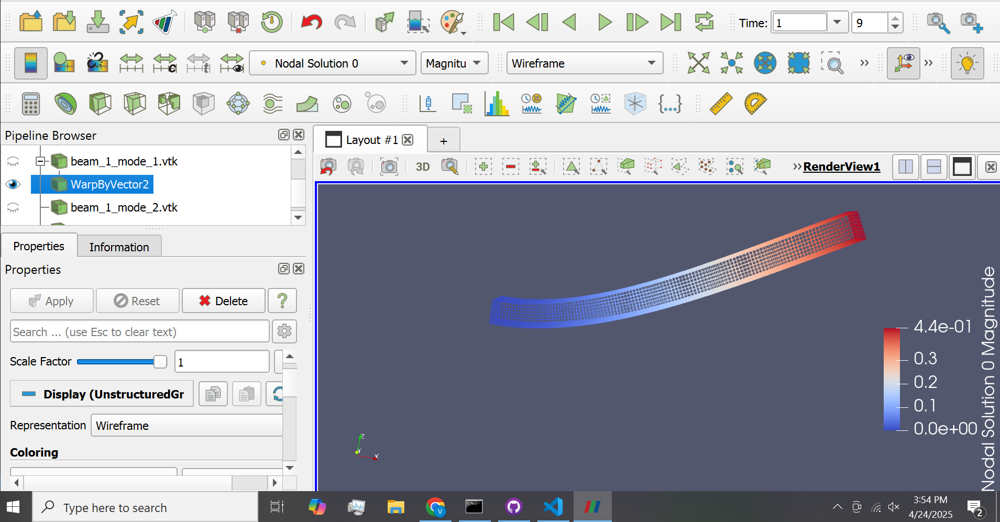

# ANSYS Asymmetric Modes Identifier
 Uses (py)Ansys Mechanical to perform modal analysis and create a dataset of parameterized structures and their ansymmetric mode(s), with the end goal being to create an ml model which takes in an asymmetric mode and outputs a structure (material, configuration) and the required frequency

# Preliminary Results
